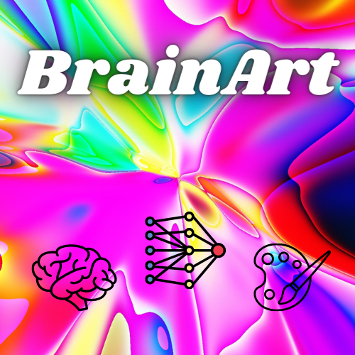

# BrainArt 

An exploration into pairing Creative Neural Networks with actual neural networks in the human brain using interpreted brain activity

## Setup

Download the BrainArt repository either by:
* Downloading the zip file by clicking `Code` and then `Download Zip`
* Cloning this repository using `git clone git@github.com:Union-Neurotech/BrainArt.git`
    * You will need git to already be installed in order to do this. More info on git cloning here: https://docs.github.com/en/repositories/creating-and-managing-repositories/cloning-a-repository

### Windows

There are two ways which you can setup this project.

#### 1. Setup Script

The setup script titled `windows_setup.bat` is designed to simplify the process of setting up BrainArt.

To utilize, run `windows_setup.bat` and follow the instructions. Make sure to run in administrator mode for best results.

Once you are finished you should be able to proceed to the next step.

#### 2. Manual Setup

The setup script automatically:
* Creates an environment variable `BrainArt` that points to the directory for running BrainArt.
* Creates a python virtual environment titled `.esp`
* Installs all neccessary python packages to `.esp`

To manually do this, you can create an environment variable by:
* Going to `Editing the system environment variables` in control panel, clicking on `Environment Variables` and manually inputing a variable titled **BrainArt** in User Variables and set it equal to the root directory of BrainArt.
    * Example: `C:\software\BrainArt`

### MacOS

There is currently no functioning version that works on MacOS.
The MacOS setup script does not work yet. It is under construction.

## Running BrainArt

Now that you have everything installed. You can run BrainArt. The easiest way is to simply run `BrainArt.bat` by double clicking the program or running it through a terminal.

You can also perform this manually by: 
* Opening a terminal in the root directory of BrainArt
* Activating the virtual environment using `.esp/Scripts/activate.bat`
* Running BrainArt using `streamlit run src/BrainArt.py`

## Roadmap

We are actively working on improving the intentionality of Brain Generated Artwork! We are working towards in the future adding:
* Real time artwork representative of real time biosignals
* Emotion recognition and interpretation
* Experimenting with alternative AI Art Generation Models

## Acknowledgements

This project is a modification of the Telepathic Polluck project created for the 2022 Brain.io hackathon. The original project is accessible here: `https://github.com/LeonardoFerrisi/telepathic-polluck`

Special thanks to all of the wonderful collaborators who made this project possible:
* Leonardo Ferrisi (me lol)
* Ian Jackson 
* Anuj Swaminathan
* Dr. Reethee Antony
* Chiharu Mamiya
* Ha Truong
* Molly Rusgrove
* Maya Mau

