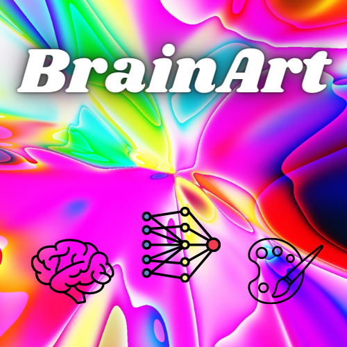

# BrainArt



Pairing creative neural networks (a CPPN art generator) with *actual* neural
activity. BrainArt turns a 4-channel Muse EEG stream into a continuous
**valence/arousal** estimate and uses it to drive generative artwork in real time.

---

## Repository layout

```
BrainArt/
├── emotion_pipeline/      Live EEG → valence/arousal model + WebSocket server
│   ├── brainart_muse_server.py    Muse → baseline → inference → calibration → WebSocket
│   ├── train_muse_va_live.py      (re)trains the model from the FACED dataset
│   ├── models/                    muse_va_live.npz/.json  (+ muse_va_calib.json once calibrated)
│   ├── research/                  the experiment + findings behind the design
│   └── README.md                  pipeline deep-dive
├── web/                   Live web-art client (WebGL CPPN), reads the WebSocket
│   └── brainart_emotion.html  + brainart_emotion.js / cppn.js / vertex.js
├── src/                   Legacy Streamlit desktop app (src/BrainArt.py)
├── brainart-tauri/        Experimental Tauri desktop wrapper
├── data/  generated/  tests/
└── requirements.txt, BrainArt.bat, windows_setup.bat, macOS_setup.sh
```

There are two ways to run BrainArt: the **live emotion → web art** pipeline
(current focus, below) and the **legacy Streamlit app** (further down).

---

## A. Live emotion → web art  (Muse → valence/arousal → generative visual)

A small Python process owns the Muse, infers valence/arousal from a sliding
window, and broadcasts it over a local WebSocket. The web page connects and the
artwork updates continuously.

### 1. Install
```bash
pip install brainflow websockets numpy scikit-learn pandas
```

### 2. (Optional) retrain the model
A trained model already ships in `emotion_pipeline/models/`. Only retrain if you
want to change features — and note this needs the **FACED dataset** (not in this
repo). From inside `emotion_pipeline/`:
```bash
python train_muse_va_live.py        # writes models/muse_va_live.npz + .json
```

### 3. Start the server
From inside `emotion_pipeline/`:
```bash
# real Muse headset:
python brainart_muse_server.py --board muse_2      # or --board muse_s / muse_2016
# OR no hardware — synthetic stream to test the whole web wiring:
python brainart_muse_server.py --sim
```
With a real Muse it first runs a **~90 s rest baseline** — sit still and relax
while the terminal shows `[baseline] …`. Then it prints `live` and begins
streaming on `ws://localhost:8765`.

### 4. Open the web art
Open `web/brainart_emotion.html` in a browser (Chrome/Edge). Click **go live**
(top-right of the panel). The status dot:

- **grey** = offline, **amber** = baseline (sit still), **green** = live.

The artwork now eases continuously toward your live valence/arousal. The manual
sliders are disabled while live and re-enable when you stop.

### 5. (Optional) Calibrate to fill the −1…1 range
Raw output clusters near neutral. Calibration stretches it to *your* range:

1. While live, open the **Calibration** panel. For each condition
   (joy / fear-anger / calm-tender / sad / neutral), play a matching clip and
   click that condition's button — it records for ~90 s.
2. Click **fit & save** (after ≥2 conditions). The server fits a per-axis affine
   and saves `models/muse_va_calib.json`, auto-loaded on future runs.
   **reset** clears it.

> Calibration fixes **range/centering, not accuracy**. The model's cross-subject
> correlation is modest (r≈0.15 valence, ≈0.12 arousal), so the readout is
> *valence/arousal relative to your own neutral* — directionally meaningful, not
> a precise absolute measurement. See `emotion_pipeline/README.md` for the full
> rationale, timing, and tuning knobs.

### Tuning timing
Sliding 30 s window, new estimate every 1 s, broadcast at 4 Hz; the browser
interpolates every frame for smooth motion. A full mood swing trails by ~10–15 s.
Adjust `WINDOW_SEC` / `EMA` in the server and `LIVE.smooth` in
`web/brainart_emotion.js`.

---

## B. Legacy Streamlit app

The original EEG-art app lives in `src/` and runs under Streamlit.

### Windows
- **Setup:** run `windows_setup.bat` (as administrator). It creates the `BrainArt`
  environment variable, a `.esp` virtual environment, and installs
  `requirements.txt`.
- **Run:** double-click `BrainArt.bat`, or manually:
  ```bat
  call .esp\Scripts\activate.bat
  streamlit run src/BrainArt.py
  ```

### macOS
Not yet supported — `macOS_setup.sh` is under construction.

---

## Roadmap
- [x] Real-time artwork from real-time biosignals (live pipeline above)
- [ ] Emotion recognition / interpretation (valence/arousal model)
- [x] Per-user calibration for full dynamic range 

## Acknowledgements
A modification of the Telepathic Polluck project (2022 Brain.io hackathon):
`https://github.com/LeonardoFerrisi/telepathic-polluck`. Thanks to the
collaborators who made this possible: Leonardo Ferrisi, Ian Jackson,
Anuj Swaminathan, Dr. Reethee Antony, Chiharu Mamiya, Ha Truong, Molly Rusgrove,
and Maya Mau.
